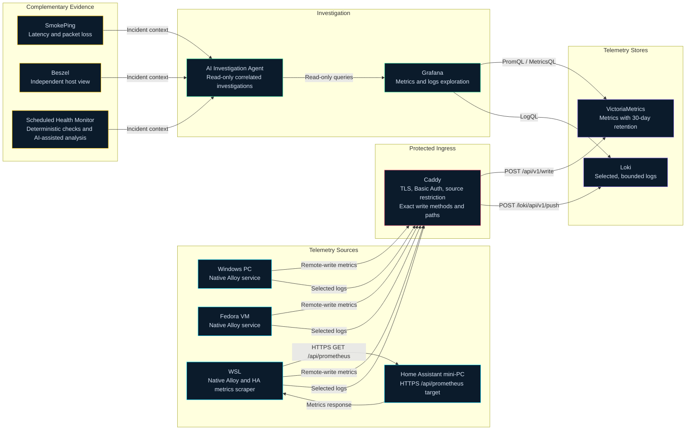

# Home Services

A collection of Docker Compose files for self-hosting various services at home.

## Table of Contents

- [About](#about)
- [Stacks](#stacks)
  - [Core Stack](#core-stack)
  - [Observability Stack](#observability-stack)
  - [Proxy Stack](#proxy-stack)
  - [Photo Stack](#photo-stack)
  - [AI Stack](#ai-stack)
  - [Media Stack](#media-stack)
  - [Dev Stack](#dev-stack)
  - [Home Assistant Stack](#home-assistant-stack)
  - [NVIDIA SMI](#nvidia-smi)
- [Port Allocation](#port-allocation)
- [Getting Started](#getting-started)
  - [Prerequisites](#prerequisites)
  - [Installation](#installation)
  - [Deployment Order](#deployment-order)
- [Usage](#usage)
- [Contributing](#contributing)
- [License](#license)

## About

This repository contains Docker Compose files that allow you to easily deploy and manage various services on your home server or local machine. The goal is to simplify the setup and maintenance of self-hosted applications for personal use.

Most stacks are defined as Docker Compose files. A few (Core, AI, Media, Home Assistant) also include experimental Podman equivalents (`podman-compose.yaml`, or Kubernetes-style pod manifests for `podman kube play`). This Podman path is a work in progress and isn't fully documented yet — treat the Docker Compose files as the primary way to run each stack.

## Stacks

This repository is organized into several categories of services, each with its own directory containing the relevant `docker-compose.yaml` file and any necessary configuration files.

### Core Stack

This directory contains Docker Compose files for running core services.

*   **[Portainer](https://www.portainer.io/):** Enterprise-grade container management, simplified and engineered for everyone.
*   **[Dockhand](https://github.com/Finsys/dockhand):** A lightweight Docker and Compose stack management UI.
*   **[Arcane](https://github.com/getarcaneapp/arcane):** Modern Docker and Compose management UI with auth, encrypted secrets, and multi-environment agent support.
*   **[Cloudflare Tunnel](https://github.com/cloudflare/cloudflared):** Exposes local services to the internet without opening inbound ports.

### Observability Stack

This directory contains Docker Compose files for running observability services.

*   **[Uptime Kuma](https://github.com/louislam/uptime-kuma):** Self-hosted monitoring tool for tracking uptime of services and endpoints.
*   **[Beszel](https://github.com/henrygd/beszel):** Lightweight server monitoring hub and agent for tracking host resource usage.
*   **[SmokePing](https://oss.oetiker.ch/smokeping/):** Tracks network latency and packet loss for local infrastructure and Internet destinations. No public reverse-proxy route is configured.
*   **[Grafana](https://github.com/grafana/grafana):** The open and composable observability and data visualization platform.
*   **[VictoriaMetrics](https://victoriametrics.com/):** Fast, cost-effective monitoring solution and time series database.
*   **[Loki](https://github.com/grafana/loki):** Log aggregation and storage system.



### Proxy Stack

This directory contains Docker Compose files for running proxy services.

*   **[Caddy](https://caddyserver.com/):** Reverse proxy for local services with automatic HTTPS.

### Photo Stack

This directory contains Docker Compose files for running Immich, our self-hosted photo and video management solution. It replaces a previous "Cloud Stack" that also included Nextcloud; Nextcloud has been dropped and only the Immich-based photo stack remains.

*   **[Immich](https://github.com/immich-app/immich):** High performance self-hosted photo and video management solution (server, machine learning, database, and cache components).

### AI Stack

This directory contains Docker Compose files for running AI-related services.

*   **[Ollama](https://github.com/ollama/ollama):** A service for running large language models locally.
*   **[Open WebUI](https://github.com/open-webui/open-webui):** An extensible, feature-rich, and user-friendly self-hosted AI platform designed to operate entirely offline.
*   **[n8n](https://github.com/n8n-io/n8n):** Workflow automation platform that gives technical teams the flexibility of code with the speed of no-code. Sample workflows are included in `n8n_workflows/`.
*   **[SearXNG](https://github.com/searxng/searxng):** A free internet metasearch engine which aggregates results from various search services and databases.
*   **[PostgreSQL](https://www.postgresql.org/)** (with the [pgvector](https://github.com/pgvector/pgvector) extension): Relational database used for long-term memory/embeddings, plus a separate instance backing n8n.
*   **[Qdrant](https://github.com/qdrant/qdrant):** High-performance, massive-scale Vector Database and Vector Search Engine for the next generation of AI.
*   **[Redis](https://redis.io/):** In-memory cache used for short-term memory.
*   **[Hermes Agent](https://github.com/NousResearch/hermes-agent):** Self-improving AI agent from Nous Research with persistent memory, skills, and multi-platform messaging gateways. Runs as a gateway service plus a loopback-only web dashboard for configuration. API keys and provider config live in `ai/hermes.env` (not committed).

### Media Stack

This directory contains Docker Compose files for running media-related services.

*   **Plex:** A popular media server for organizing and streaming your personal media collection.
*   **Jellyfin:** Another open-source media server, similar to Plex, offering a free and customizable experience.
*   **[Navidrome](https://github.com/navidrome/navidrome):** A self-hosted music streaming server compatible with the Subsonic API.

### Dev Stack

This directory contains Docker Compose files for self-hosted development tools. It starts out minimal and will grow over time as more dev tools are added.

*   **[Forgejo](https://forgejo.org/):** Self-hosted lightweight Git forge. Currently running standalone with its built-in SQLite database — a dedicated database service may be added later if needed.

### Home Assistant Stack

This directory contains Docker Compose files for running Wyoming whisper and piper services.

*   **[Whisper](https://github.com/rhasspy/wyoming-faster-whisper):** Wyoming protocol server for faster whisper speech to text system.
*   **[Piper](https://github.com/rhasspy/piper-samples):** Samples for Piper text to speech system.

### NVIDIA SMI

This directory contains a minimal Docker Compose file used to verify that GPU passthrough is working correctly before deploying GPU-dependent stacks (it just runs `nvidia-smi` inside a container). It requires the [NVIDIA Container Toolkit](https://docs.nvidia.com/datacenter/cloud-native/container-toolkit/install-guide.html) to be installed on the host.

## Port Allocation

Each stack owns a reserved block of 100 host ports, so a new service can always be given a free port without colliding with another stack. When adding a service to a stack, pick the next unused port within that stack's range and record it in the stack's `.env.example`.

| Stack | Range | Notes |
|---|---|---|
| Core | 10100-10199 | Portainer 10100, Dockhand 10110, Arcane 10120 |
| AI | 10200-10299 | Ollama 10200, Open WebUI 10201, n8n 10202, Qdrant 10230, pgvector 10240, Hermes Dashboard 10250 |
| Photo | 10300-10399 | Immich Server 10300 |
| Media | 10400-10499 | Jellyfin 10400, Plex 10401, Navidrome 10402 |
| Dev | 10500-10599 | Forgejo HTTP 10500, Forgejo SSH 10522 |
| _unassigned_ | 10600-10799 | Free — reserved for future stacks |
| Home Assistant | 10800-10899 | Whisper 10800, Piper 10801 |
| Observability | 10900-10999 | Grafana 10900, Uptime Kuma 10901, Beszel 10902, SmokePing 10903 |
| Proxy | — | Uses fixed ports 80/443 |

## Getting Started

### Prerequisites

Before you begin, ensure you have the following installed:

*   **Docker:**  [Install Docker](https://docs.docker.com/get-docker/)
*   **Docker Compose:** [Install Docker Compose](https://docs.docker.com/compose/install/)
*   **NVIDIA Container Toolkit** (optional): required only for GPU-accelerated services (Ollama, Plex, Jellyfin, Immich ML) — [install guide](https://docs.nvidia.com/datacenter/cloud-native/container-toolkit/install-guide.html)

### Installation

1.  Clone this repository:

    ```
    git clone https://github.com/dmardus/home-services.git
    cd home-services
    ```

2.  Create all external Docker networks before deploying any stack. Compose treats these networks as prerequisites, and the observability stack also uses `proxy-network` for Caddy access.

    ```bash
    docker network create proxy-network
    docker network create observability-network
    docker network create core-network
    docker network create ai-network
    docker network create photo-network
    docker network create media-network
    docker network create dev-network
    docker network create wyoming-network
    ```

3.  Copy `.env.example` to `.env` in each stack you plan to deploy and fill in your own values. The `.env` files are gitignored, so credentials and local settings remain private.

### Deployment Order

After the external networks and environment files are ready, use this recommended deployment order:

1.  **Observability:** Starts VictoriaMetrics, Loki, Grafana, and the supporting monitoring services.
2.  **Proxy:** Starts Caddy after its observability upstreams are available.
3.  **Core:** Starts container-management and other core services.
4.  **Remaining stacks:** Deploy AI, Photo, Media, Dev, Wyoming, and other independent stacks in any order.

From each stack directory, run:

```bash
docker compose up -d --force-recreate --remove-orphans --pull always
```

This downloads the required images and starts each stack in detached mode. Once all dependencies are running, configure or start external telemetry clients such as Alloy.

## Usage

*   **Accessing Services:** After the services are running, you can access them by navigating to the appropriate port in your web browser (e.g., `http://localhost:8080`).  Refer to the specific service's documentation for default ports and configuration options.
*   **Updating Services:** To update a service, navigate to its directory and run:

    ```
    docker compose pull
    docker compose up -d
    ```

*   **Optional: Clean up old unused containers/images**
    ```
    docker system prune -f
    ```

## Contributing

Contributions are welcome! If you have improvements, new service configurations, or bug fixes, please submit a pull request.

## License

This project is licensed under the MIT License - see the [LICENSE](LICENSE) file for details.
